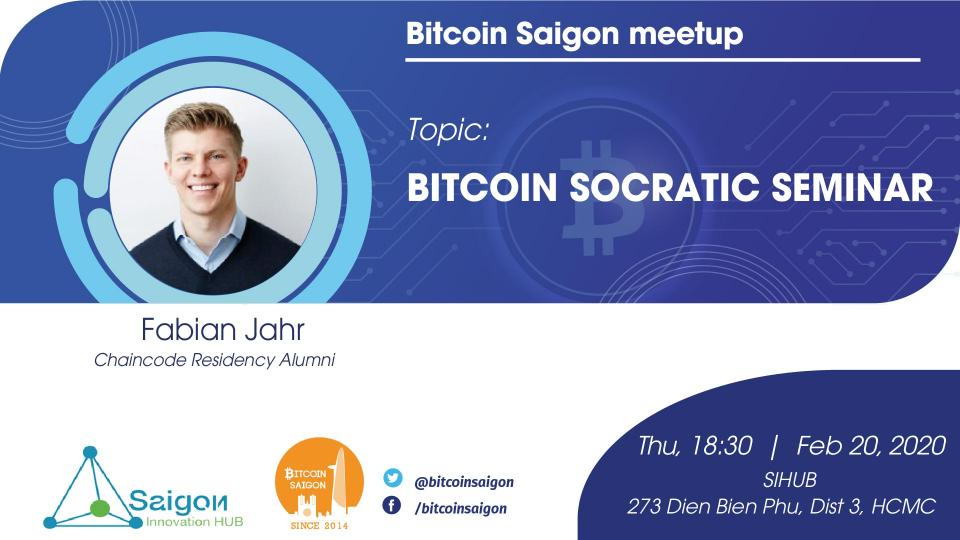

Besides our regular weekly meetups - we have in February a special Bitcoin Saigon meetup coming up again!
 
[Fabian Jahr](https://github.com/fjahr "Fabian Jahr") ([Chaincode](http://www.chaincode.com "Chaincode") Labs residency alumni) is leading, in the style of the [meetups in Berlin](https://www.meetup.com/de-DE/Bitcoin-Lab-Berlin/ "meetups in Berlin"), a [Bitcoin](https://bitcoin.org/ "Bitcoin") Socratic Seminar!

Details:

The Socratic Seminar event is formatted to foster debate, information sharing and lively discussion on various (mostly technical) topics around Bitcoin.

 In the weeks preceding the event, discussion topics are collated by meetup members from a variety of sources: pull requests in popular git repositories (e.g. Bitcoin Core, lnd, c-lightning, Joinmarket and Electrum), research papers, technical blog posts, IRC logs, network monitors and more. To complete the meeting, members can present open source projects, companies, research and other relevant materials.

Fabian Jahr is visiting from Berlin and will be hosting the event. The Bitcoin Socratic Seminar events have a great tradition in [New York](https://bitdevs.org "New York") with 100 meetups so far and started to be organized regularly in Berlin last month.

More information can be found here:

[https://bitdevs.berlin/about/](https://bitdevs.berlin/about/ "https://bitdevs.berlin/about/")

[https://bitcoinmagazine.com/articles/op-ed-want-to-learn-about-bitcoin-try-a-local-socratic-seminar](https://bitcoinmagazine.com/articles/op-ed-want-to-learn-about-bitcoin-try-a-local-socratic-seminar "https://bitcoinmagazine.com/articles/op-ed-want-to-learn-about-bitcoin-try-a-local-socratic-seminar")

To create a safe space for the open exchange of knowledge and ideas, this event will not be streamed or recorded.

All the links to the discussion topics will be made available after the event, so there is no need to take photos of the presentation screen.

### Meetup schedule:
- Thursday February 20, 2020
- At 18:30 PM
- Location: SIHUB, 273 Dien Bien Phu, District 3, HCMC

# ---
If you would like to support the work of the Bitcoin Saigon Community - you can donate some of your Sats to us via our [Donation](http://bitcoinsaigon.org/donate-satoshis "Donation") page! Lightning support coming soon :)
