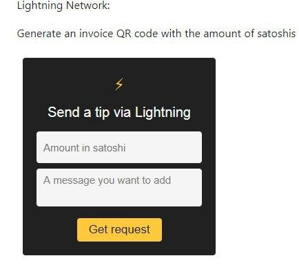
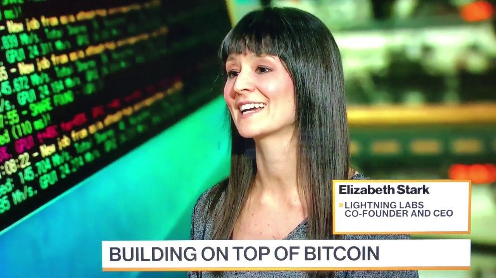

## Bitcoin Saigon - Lightning Network News
## February 2020 - Episode I

###### Bitcoin Saigon LN Node:

- Tipping feature enabled and [integrated on the donation page](https://bitcoinsaigon.org/donate-satoshis "integrated on the donation page") of Bitcoinsaigon.org
- Node publicly searchable as[ bitcoinsaigon.org](https://1ml.com/node/023e4a4c0e0e114d88ab50ec14582fefd60ad8baae63eb0934db146d995c5567d7 " bitcoinsaigon.org")

 

*You can now donate Sats directly via the Lightning Network to [Bitcoin Saigon](https://bitcoinsaigon.org/donate-satoshis)!*

*[We continue to be thankful to the work done by [Albert](http://www.twitter.com/subnetmask "Albert") of [Neutronpay](http://www.neutronpay.com "Neutronpay") and [Tomo](http://www.twitter.com/tomoxtechno "Tomo") of [BitcoinVN](http://www.bitcoinvn.io "BitcoinVN") who are volunteering their free time to build out this infrastructure for our community]*

###### General Lightning Network ecosystem news:

- Lightning Labs [releases LND client 0.9](https://blog.lightning.engineering/announcement/2020/02/05/loop-beta.html "releases LND client 0.9")

------------
→ *" Loop is a service that makes it easier to send and receive funds on Lightning, 
serving as an on and off ramp between the Lightning Network and the Bitcoin 
Blockchain."*

*Elizabeth Stark of Lightning Labs got a financial boost this month to further build out LN infrastructure*

- Lightning Labs [raises 10m USD](https://www.coindesk.com/lightning-labs-raises-10m-series-a-to-be-the-visa-of-bitcoin "raises 10m USD") funding

------------
*"Beyond Loop, [Stark](http://www.twitter.com/starkness "Stark") said her startup will focus on options for larger payment channels in 2020, both opt-in channels that can individually hold more than $1,500 and Atomic Multi-Path Payments, which break payments into smaller parts and are able to return the whole amount if all the small parts don’t promptly arrive at the same recipient”*

*Jack Mallers launched a new tool to simplify Lightning payments - meet him at [Cryptoecon2020](http://www.cryptoecon.org/) in Hanoi this month!*

- [Jack Mallers releases Ln_strike](https://bitcoinmagazine.com/articles/with-strike-zap-rethinks-its-olympus-fiat-to-bitcoin-feature "Jack Mallers releases Ln_strike") for general users

------------
*"[Strike] allow the wallet’s users to buy bitcoin via Lightning with USD for direct deposit into their Zap wallets, is being rolled out in a new form for now, the service will accept new users on a rolling, weekly basis from its beta program list. [Mallers hopes to have Strike ready for full public access](https://zap.jackmallers.com/ "Mallers hopes to have Strike ready for full public access") by the end of Q1 2020.”
→ Jack Mallers will be present at [CryptoEcon2020](https://bitcoinsaigon.org/cryptoecon-2020-hanoi/ "CryptoEcon2020") in Hanoi at the end of February!*

- [Anthony Potdevin](https://github.com/apotdevin "Anthony Potdevin") releases Open Source LND node manager [Thunderhub](https://thunderhub.io/ "Thunderhub")

------------

*"It's completely open source, so you can either get it running locally or using the website. You can manage your node completely. From sending and receiving invoices, on chain transactions, forward and transaction reports to full channel management and if you have LND v0.9.0 or up then channel balancing as well.”*

------------

*[We would like to express our continued gratitude to our Lightning Network Community Node sponsors [BitcoinVN](http://www.bitcoinvn.io "BitcoinVN"), [future.travel](http://www.future.travel "future.travel ") and [Neutronpay](http://www.neutronpay.com "Neutronpay") who helped us to fund the infrastructure and initial capacity to launch our node! If you would like to become a Bitcoin Saigon Lightning Node sponsor as well, feel free to reach out to us via one of our Social Media channels or hit us up at the next meetup!]*

---
*If you would like to support the work of the Bitcoin Saigon Community - you can donate some of your Sats to us via our [Donation page](http://bitcoinsaigon.org/donate-satoshis "Donation page")!*

