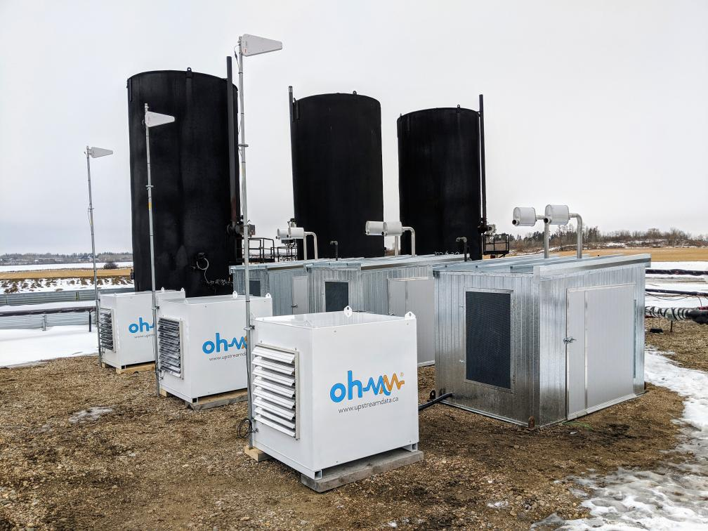

## CryptoEcon 2020 - Interview Steve Barbour (Owner UpstreamData)

Vietnam has, thanks to the efforts of Eric Voskuil and [Libbitcoin Institute](http://www.libbitcoin.org "Libbitcoin Institute"), the honor to host the very first [CryptoEcon](https://cryptoecon.org/ "CryptoEcon") conference - happening at the end of this month in Vietnam’s bustling capital of Hanoi.

In our series of interviews with the hand-selected speakers leading up to the event we had the opportunity to talk with [Steve Barbour](https://twitter.com/SGBarbour "Steve Barbour"), who in early 2017 made a shift from his previous career as Mechanical Engineer and Project Manager in the Canadian energy sector into combining his extensive experience and skill set in the traditional energy sector with the world of Bitcoin mining.

Spotting an opportunity to turn excess energy produced in oil & gas wells into Bitcoin, he created [Upstream Data](https://www.upstreamdata.ca/ "Upstream Data") which prides itself to design, construct and operate modular bitcoin mining solutions for upstream oil and gas facilities and thereby reducing GHG emissions by monetizing stranded gas such as vented and flared natural gas at oil production facilities.

**Q1: Hello Steve! Thank you for taking the time ahead of CryptoEcon2020 to speak with us! Our standard opener question: When and how did you hear the first time about Bitcoin and when was the moment, that you got convinced that this might be a good next move in your career?**

**Steve:** Well I don’t remember when I first heard of bitcoin but I vaguely recall it was somewhere around 2013 when it was on the news as “hacker money”. I dismissed it at the time as they made it out to be like a penny stock kind of vibe and didn’t really explain any of the cool features of the money. Then in 2016 I made a professional decision to leave my career path as an engineer at a Canadian oil and gas company to pursue an interest in designing downhole tool. During this transitional period I had a lot of downtime and  I decided to figure out what this Bitcoin thing was all about. I think it took me less than 48 hours to realize that bitcoin mining was a great solution to stranded energy and since I was well aware of the stranded natural gas problem in oilfield I immediately started thinking about how I could use bitcoin mining to solve this problem.

**Q2: One probably can say that you work at a true frontier when it comes to Bitcoin infrastructure in the physical world. In 2017 you decided to launch your company Upstream Data, which is building out solutions to turn otherwise wasted energy into Bitcoin and not only that, but also reducing GHG emissions while doing so. What people were fantasizing about on Bitcointalk years ago - you turned it into a reality. How did Upstream come about, how happy are you with the results so far, and what’s up next?**

**Steve:** Well actually the first thing I did after thinking about this solution was to go onto Bitcointalk, create an account and lurk on the mining subforum. It was there actually I got a lot of great advice and answers to a lot of questions I had. I had zero experience building bitcoin mines, data centers or electrical systems in general so for the next few months I spent a ton of time learning everything I could. I started Upstream Data after a couple months of learning and brainstorming ideas and by early 2017 I had finished my first design and started on the prototype. My goal from day one was to create products that oilfield producers would want to buy, so that’s what I’ve been doing with Upstream Data ever since.

**Q3: In recent years with the ever growing energy expenditure to secure the Bitcoin network, Bitcoin has become a target by environmentalists and people who use environmentalist arguments as a welcome cover to attack Bitcoin. What is your response to this and how can the Bitcoin community shift the narrative on that matter?**

**Steve:** Personally I do think that this environmental-waste narrative will be one of the biggest talking points for the anti-bitcoin factions out there in the years to come. I guess my best response to them is in my actions - building Upstream Data. We build products that convert a wasted, limited resource into something useful and help oil and gas producers produce more efficiently.. I think this is the best argument I can put forward.

**Q4: CryptoEcon2020 is a conference series with a very specific scope of topics; exploring the impact of economic concepts and models as one of core underlying tenets which make or break Bitcoin. What sparked your specific interest to participate at CryptoEcon2020 and what role may a deeper understanding of these concepts play for Bitcoin business such as yours in the wider realm of the overall Bitcoin ecosystem?**

**Steve:** I was very happy to have been asked to speak by Eric as I had been following his work quite a while. The [libbitcoin wiki](https://github.com/libbitcoin/libbitcoin-system/wiki/Cryptoeconomics "libbitcoin wiki") has had a deep influence on how I think about bitcoin in the context of economic theory and I think Eric has done a fantastic job debunking a lot of the nonsense FUD that continues to float around the space, distracting people and causing them to waste their time on pointless projects like proof-of-stake. If anything I think the concepts that will be discussed in this conference have really helped me avoid wasting time on similar distractions.

**Q5: The inaugural CryptoEcon2020 is taking place in Hanoi, the capital of Vietnam which has been the world’s fastest growing economy of the past decade behind India. What are your expectations for Vietnam and where do you perceive the opportunities for emerging economies in regard to Bitcoin?**

**Steve:** I simply cannot wait to arrive in Vietnam. I know practically nothing of this country so I am hopeful I will be able to spend some time touring around and taking in the culture and cuisine. I’m just hoping that work doesn’t get in the way of enjoying myself as I still wear far too many hats at Upstream Data. 

**Q6: Your panel at CryptoEcon2020 is going to be about “Survivable Ecosystem”. Can you give us a primer of what you see to be necessary to build in order to create such a resilient, surviveable ecosystem?**

**Steve:** I would say the number one thing that all of us designing bitcoin-related systems need to be aware of is the need to use bitcoin anonymously. And not just payments and transactions, but mining. I think it’s very important to lower the barrier of entry to mining so that more people can participate, increase the network depth and to do so anonymously. Mining anonymously is so important because it is critical that miners can continue mining if there are mining bans or other unjust laws censoring honest miners. I am working to build mining tools and equipment to lower the barrier of entry for newbies so that the network is more resilient against State attacks or otherwise in the future.

**Q7: Bitcoin is now going in its second decade of existence. After taking the world’s attention by storm in the first ten years, where do you see Bitcoin heading next and what developments you are the most excited about?**

**Steve:** I am extremely confident that bitcoin adoption will continue to grow, it is simply too useful to fade away any time soon. I think we will see some really badass developments in the next 10 years including the unprecedented widespread adoption by the oil and gas industry and even a dramatic increase in home and small commercial mines all around the world. The bitcoin network has a natural pressure to distribute due to it’s proof-of-work distribution mechanism and I think it could be the most powerful force for good humanity has ever seen.

---

*If you are looking to attend CryptoEcon 2020:*

*The space is limited to only about 100 attendees - so if you want to participate [make sure to grab your tickets here](https://www.eventbrite.com/e/cryptoecon-2020-tickets-84241838607 "make sure to grab your tickets here") in time!*

---

*If you would like to support the work of the Bitcoin Saigon Community - you can donate some of your Sats to us via our [Donation page](http://bitcoinsaigon.org/donate-satoshis "Donation page")! Lightning Network supported!*

