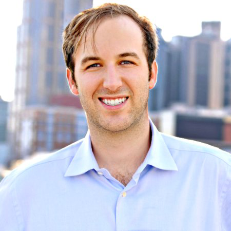

Update March 7: Bitcoin2020 conference has been officially postponed due to the Coronavirus sitution.
[More details](https://bitcoinmagazine.com/articles/postponed-bitcoin-2020-is-moving-to-q3-2020)

## David Bailey Interview - Bitcoin Saigon

Just one more month to go until the second edition of the [Bitcoin Conference](https://www.bitcoin2020conference.com/ "Bitcoin Conference") hosted by [Bitcoin Magazine](https://bitcoinmagazine.com/ "Bitcoin Magazine") is going to take place in San Francisco.

Designed as the annual global get-together of Bitcoiners from all across the globe the event had a successful premier in 2019 and could attract notable speakers who have contributed to the evolvement of Bitcoin in the past decade in various roles of the ecosystem such as VC investor legend and early Bitcoin investor Tim Draper, Bitcoin Core Developer Matt Corallo, pioneering Bitcoin Startup entrepreneur Erik Voorhees, the notorious Max Keiser who was one of the first financial market commenters to recommend Bitcoin as an investment to his audience and many more.

We had the chance to talk with [David Bailey](https://twitter.com/DavidFBailey "David Bailey"), Founder and CEO of [BTC Inc.](https://b.tc/ "BTC Inc."), the mother company behind Bitcoin Magazine and many other notable publications and media projects in the scene about the upcoming event and what to expect this year.

**Q1: David, you have been around & active in the scene for a fairly long time. When did you the first time hear about Bitcoin and when and why did you decide to pursue a full-time career in the space?**

**David:** Back in 2012, one of my friends in college told me to check out this "silk road" thing that people used this "bitcoin" thing to transact on. I took one quick look at it and told him it was a scam. Then I set out to prove it was a scam, and the more I looked into it, the more I realized it was something huge! After a couple weeks of researching it pretty heavily, I was hooked and have devoted most of my time to it ever since.

**Q2: One of your first ventures in the space was the still-existing yBitcoin magazine. We recall that at the time it was pretty “revolutionary” for the fledgling Bitcoin space since its target audience was decisively to serve as an introductory guide for the “grown-ups” in the legacy finance/investment world at a time, where Bitcoin still was mostly defined by its local communities which consisted largely of your typical early Bitcoin adopters of libertarians, anarchists, hackers, cypherpunks, geeks, nerds and other “non-mainstream” mavericks. When and how did you come up with the idea and how has the reception been?**

**David:** Bitcoin was really just my attempt at gathering information and sourcing it so I could make sense of everything going on in Bitcoin. I spent all my time when I was first getting into Bitcoin traveling to different conferences and meeting all sorts of crazy smart people who could explain the technology better than anyone. I realized pretty quickly that I could aggregate all the info I was learning on my journey, along with help from some of these super smart people, bind it into a magazine, and ship it around the world.

The reception to it has been great. One of my favorite things in the entire world is visiting a company on the other side of the globe from me and seeing a yBitcoin magazine lying around or in a bookshelf. It's such a special feeling to spread the message of Bitcoin.

**Q3: You are one of the longstanding pioneers in the Bitcoin-related/-focused media landscape. What changes have you seen occurring in the Bitcoin media industry over the years, how did the remarkable decision of Bitcoin Magazine come about to decisively [refocus its coverage on Bitcoin](https://medium.com/`@`BitcoinMagazine/make-bitcoin-fun-again-47c6837788c3 "refocus its coverage on Bitcoin") and how do you think the media industry is going to evolve in the coming years from here on?**

**David:** This space in general has matured over the years, and we as a company have matured with it. I cannot stress enough how challenging it is to run a business in the Bitcoin space. The pace is faster than anywhere else in the world, the information is incredibly fragmented due to the decentralized nature of Bitcoin, and of course the market/ecosystem will grow by 10-100x and then shrink by 80% before you've even scaled to keep up with the growth! It's sometimes comical to try to stay on top of everything. In ~2015-2017 we saw the market emerge around not only Bitcoin, but "blockchain" as well. We saw opportunities there and we pursued them. However the more and more we saw what the underbelly of that larger industry looked like, the more we realized our run through the token forest was really just a detour from the truly interesting and paradigm-shifting thing: Bitcoin. When you're able to really address a need, like we did with Bitcoin Magazine making it a full-time Bitcoin-only media outlet, it makes the struggle worth it. Wouldn't trade it for the world. I don't think we will be the last outlet to hone in their focus on solely Bitcoin topics.

**Q4: Together with the “return to the Bitcoin roots” by Bitcoin Magazine you also worked on the organization of the Bitcoin2019 conference; a dedicated Bitcoin conference in the spirit of the “old days” at a time where suit-loaded and content-poor “Blockchain conferences” have been flooding the globe’s major cities’ conference venues week after week. What were your main takeaways from the premier conference?**

**David:** Bitcoin 2019's goal was to bring people together and make Bitcoin fun again. I was inspired, personally, to create it because of the experience I had at Bitcoin 2013. That conference was really the moment where I fell in love with Bitcoin, so I wanted to recapture that feeling and see if we couldn't provide that same opportunity to newcomers in Bitcoin. It surpassed our expectations for what a 1st year event would look like, with nearly 2,000 attendees, all having an absolute blast. Bitcoiners just wanted a place where they could congregate and talk about Bitcoin without having to listen to someone shill them their blockchain or token or anything. That's what Bitcoin 2019 brought to the table (along with great content, great sponsors, and fun satelite events running around it).

**Q5: What should people expect from Bitcoin2020 which is going to take place in late March 2020 in San Francisco and on what parts of the conference you are especially looking forward to?**

**David:** So we've basically taken what we did with Bitcoin 2019 and doubled it. We're pouring our hearts and souls into making it the best Bitcoin conference ever, and potentially one of the best conferences of all time in general. From a blown up lightning arcade complete with classic arcade games and some brand new lightning games, and everything in between, to a rooftop beer garden with a skateboard ramp that Tony Hawk himself will be doing tricks on, to a block party with music, food trucks, and dancing, this is going to be one of the most fun experiences anyone could ever hope for. All of this is on top of some of the greatest Bitcoin content ever produced, ranging from beginner level materials to crazy topics like using Bitcoin on Mars and in space, or programming machines to pay each other in Bitcoin and truly automate parts of the economy. We will have almost every single Bitcoin company at the event, and it wouldn't be possible without each and every one of our sponsors. This really is a community driven event, and we're just the lucky ones who get to plan it and write the checks for it.

**Q6: The past ten years have been a pretty wild ride for everybody involved in the space. How do you see Bitcoin as well as its communities evolving in the coming years - and do you perceive any major threats to the success of Bitcoin and if so, which are those?**

**David:** This is just the beginning. Seriously. We're sitting right now somewhere around 0.5% of the world owning Bitcoin. The next wave may push us to ~15% of the world owning Bitcoin, and then we start hitting the tipping point where it's a race to gobble up the last remaining Bitcoins while offloading your fiat to get it. There will always be threats to Bitcoin, but some of the threats it has already overcome are astounding. It's the beauty of antifragility- what doesn't kill Bitcoin only makes it stronger. Regulators may try to crush it, countries may try to attack it, but, in the end, Bitcoin is unstoppable, and they will only end up catalyzing its adoption even further by trying to break it and failing.

----

[Bitcoin Saigon has entered into a media partnership with Bitcoin2020](https://bitcoinsaigon.org/bitcoin2020-conference/ "Bitcoin Saigon has been entered into media partnership with Bitcoin2020") - if you are looking to attend Bitcoin2020 you can pre-order your tickets [here](https://www.bitcoin2020conference.com/registration "here") and receive 20% off with the discount code “BitcoinSaigon”.

---

If you would like to support the work of the Bitcoin Saigon Community - you can donate some of your Sats to us via our [Donation page](http://bitcoinsaigon.org/donate-satoshis "Donation page")! 
