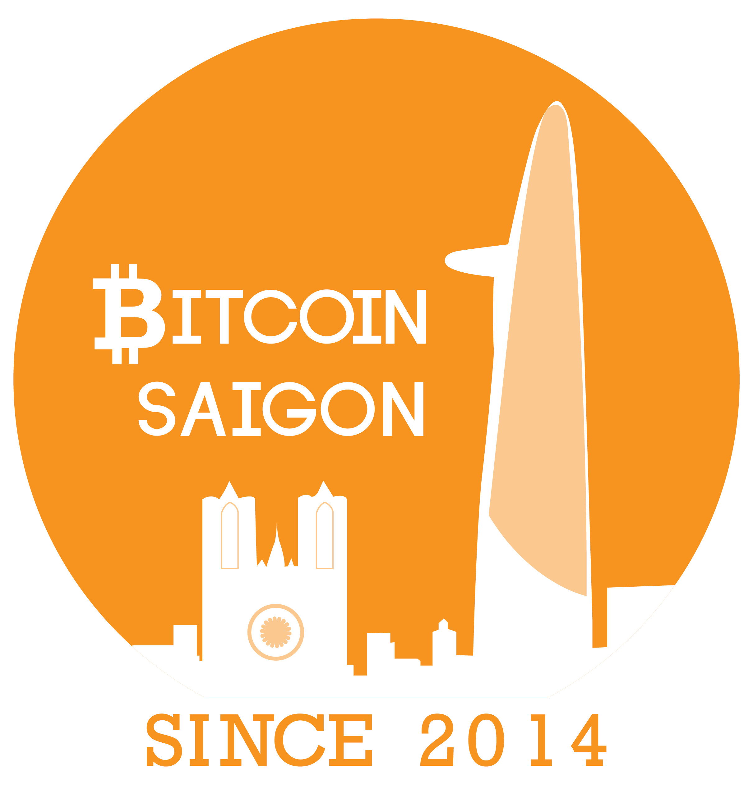

## "Industrial Bitcoin Mining after the Halving and beyond" (29.05.20 - Online Event)

After our [initial Online Meetup](https://bitcoinsaigon.org/first-online-meetup/) from April 2020 during the Coronavirus-induced lockdown our local community decided that continuing this format in the light of continued travel restrictions remains a good way to remain in touch with those community members who currently are unable to attend the [weekly offline meetups](https://twitter.com/BitcoinSaigon/status/1257088502065291265) which resumed since early May.

Besides last week’s 10th anniversary of the [annual Bitcoin Pizza day](https://bitcoinsaigon.org/10th-anniversary-pizza-day/) the main event for Bitcoiners in May 2020 was certainly the [Halving day](https://www.bitcoinhalving.com/what-is-the-bitcoin-halving) on the 10th of May which was celebrated by various online events around the world.

In this light we decided to invite you for our next Online Meetup with [Steve Barbour](https://twitter.com/sgbarbour?lang=en) (Owner of [UpstreamData](https://www.upstreamdata.ca/)) and [Thomas Heller](https://twitter.com/thomasheller_?lang=en) (Global Business Director [F2Pool](https://www.f2pool.com/)) who both work with their respective companies at the cutting edge of the highly competitive space of industrial Bitcoin mining.

You can read an interview we conducted with Steve in February 2020 ahead of the CryptoEcon 2020 conference in Hanoi [here](https://bitcoinsaigon.org/interview-steve-barbour-upstreamdata/).

You can read an interview we conducted with Thomas in the past week here:

**[awaiting interview]**

Join us for the second version of our Bitcoin Saigon Online Meetup on the 29th of May 2020!

A rough timeline:

- 8.00 PM - 8.15PM --- Warm-up & Introductions

- 8.15 PM - 9 PM ---  Moderated Online Discussion with Steve Barbour & Thomas Heller

- 9 PM onwards - Open End Q&A

**Logistics**

*For passive participants:*

The Online meetup will be fully streamed at the [Youtube Channel of Bitcoin Saigon](https://www.youtube.com/channel/UC_ndxmE3SG_FaAD24hnh_eg)

*For active participants on [Jitsi](http://jitsi.org):*

A dedicated Telegram Group will be created in which the Jitsi link will be shared

To get access to the Telegram Group you have to fulfil one of the following two requirements:

- Are a member of the private Bitcoin Saigon Telegram
- Contact Bitcoin Saigon via Social Media and donate 1,000 Sats to the Bitcoin Saigon LN node to receive the invite link

Bitcoin Saigon is the original home of the city's Bitcoin community since 2014.  Also, serving as a base for overseas experts and Bitcoin fans who visit, the group has held more than 100 events and meetups as part of our commitment to build a strong and dynamic community of Bitcoin enthusiasts and supporters.

Find us on [meetup.com](https://www.meetup.com/Bitcoin-Saigon-Meetup/)!
