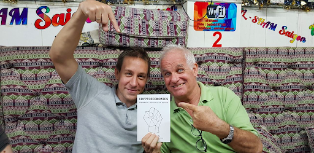
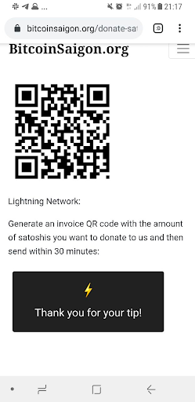

## Winner announcement -“Cryptoeconomics Book Auction”

*...and we’ve got a winner!*

[David Watson](https://twitter.com/watson_ita) from [future.travel](http://future.travel) - himself since several years an active & supporting member of the Saigonese Bitcoin Community - won out at our recently announced [“Cryptoeconomics” book auction](https://bitcoinsaigon.org/cryptoecon-book-auction/").

The winning bid was subsequently transferred via Lightning Payment to the [Bitcoin Saigon Community Lightning Node](https://bitcoinsaigon.org/donate-satoshis), which serves as a way to practically experiment with the Lightning Network as well as a community chest for the local community.

We would like to thank the author [Eric Voskuil](http://www.twitter.com/evoskuil) for the donation of the book - and of course his overall contributions to the advancement of economic discourse in the Bitcoin space.

If you missed out on the auction but still want to get access to the contents of the book - Eric open-sourced the content in the [Libbitcoin Github](https://github.com/libbitcoin/libbitcoin-system/wiki/Cryptoeconomics).

And while it might be these months not the most opportune moment - we also do not want to forget the hint, that you can book your travels, visa arrangements and more via future.travel which is accepting [Bitcoin and Lightning Payments](https://future.travel/faq/detail/43/how-can-i-pay-with-bitcoin-on-future-travel) via its checkout.

*Thanks to all participants and have you around for me in the future!*
