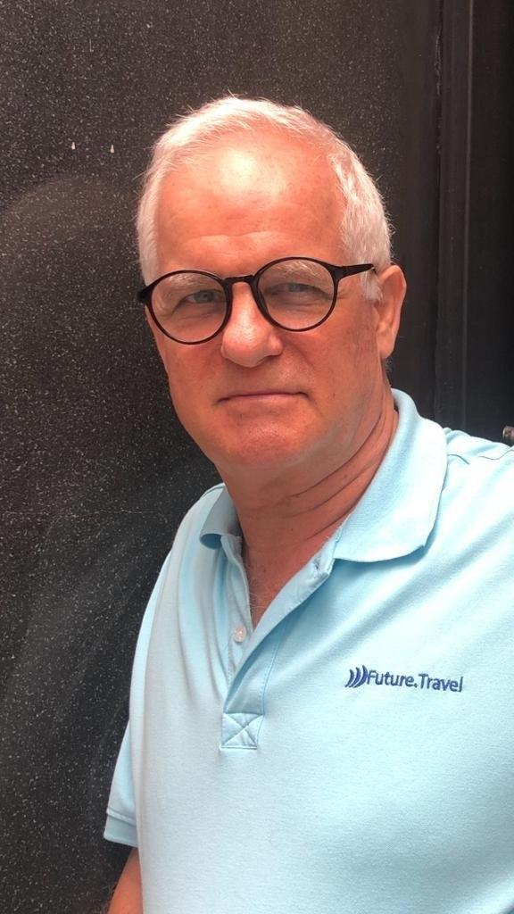
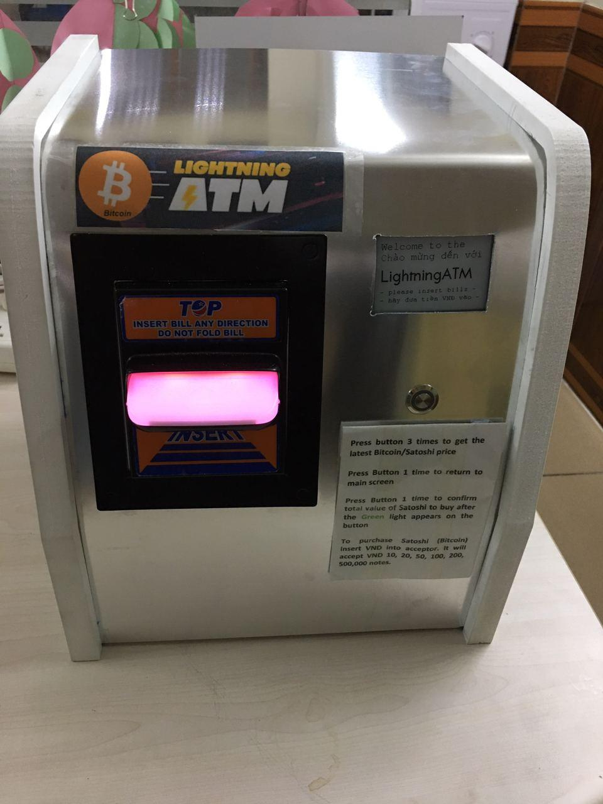
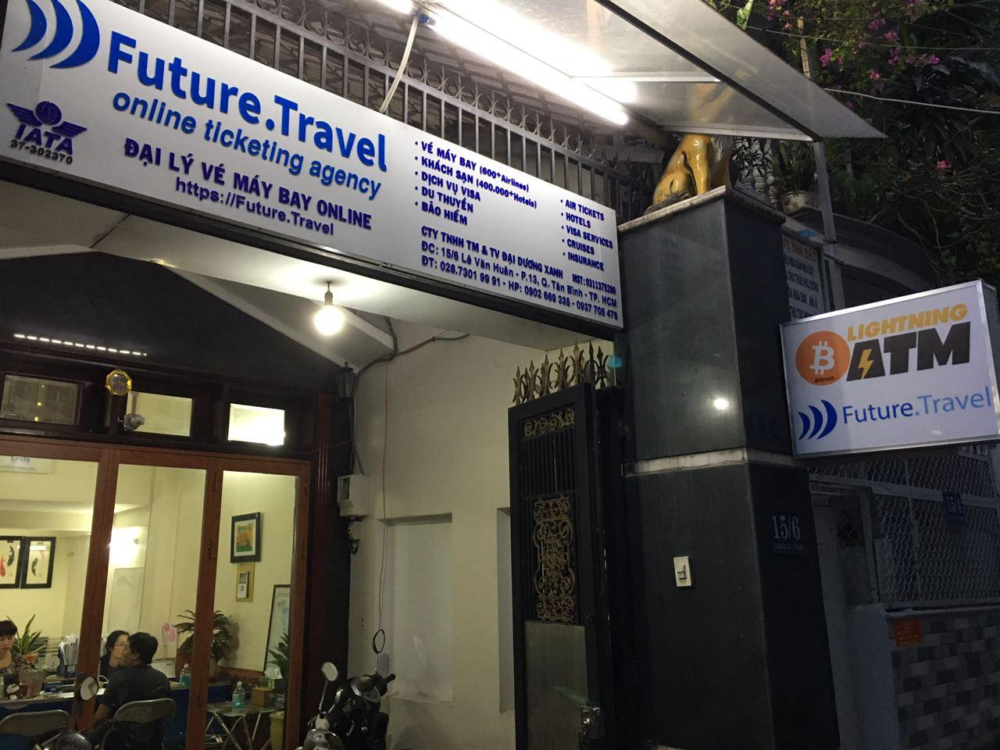
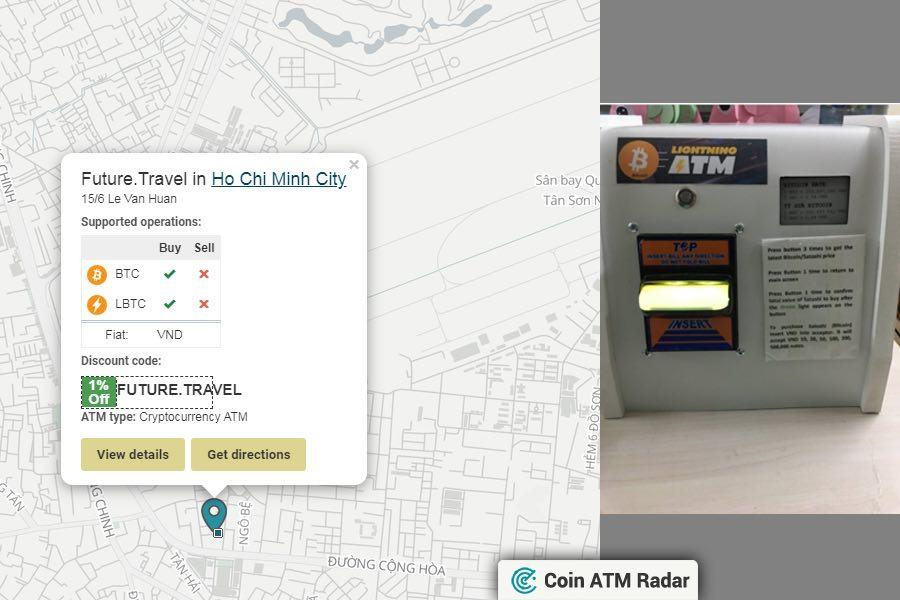

[David Watson](https://twitter.com/watson_ita), lifelong entrepreneur, and currently serving as General Director to [Future.Travel](https://future.travel/), Vietnam’s first & oldest Bitcoin-accepting Online Business has been a steady supporter of the local Bitcoin community in Saigon ever since.

Be it as sponsor at events like the Bitfilm Festival 2015, [BlockFin Asia 2016](http://blockfin.asia), expanding [merchant adoption in Saigon](https://bitcoinsaigon.org/sats-bitcoin-merchants-directory-saigon.html) or various other events and activities where he supported with his actions and connections he’s been one of the driving forces to make the Bitcoin Community in Saigon what it is.

Most recently he made headlines with deploying [Asia’s first Lightning ATM](https://news.bitcoinvn.io/first-lightning-atm-saigon-launches/?lang=en), built by an [open-source design](https://github.com/21isenough/LightningATM) provided by [21isenough](https://twitter.com/21isenough?lang=en) and with various locally sourced hardware parts; taking advantage of Vietnam being the manufacturing hub it presently is.

#### Bitcoin Saigon: Hello David! As we’ve all seen you and your team did not let up during the downtime in the travel business in 2020 and built and deployed Asia’s first Lightning ATM. Before we get further into it: How is the travel business going and where do you see the international tourism & travel industry heading in 2021? Any relief on the horizon?

**David Watson:** To put life in perspective I saw the travel industry numbers this week for OTA’s - online travel agents. We are down 90% in searches and down 99% in bookings/ticketing. That is the status as of October 2020. It is not a good scene and yet, the stronger get stronger. We as a company, are surviving and prospering in a reduced competition market where customer service counts. One bright star for us is the steady and growing number of Bitcoin flights being purchased online. 

As we have no crystal ball for the future travelwise, we do see some interesting developments coming up fast that will play out in 2021. On the fast tracking of digital currency adoption we will probably see the quarantine of fiat currencies carried abroad by returnee’s to their home countries as unexplained outbreaks of [Covid-19 being transmitted on fiat note surfaces](https://www.bloomberg.com/news/articles/2020-10-11/coronavirus-can-persist-for-four-weeks-on-banknotes-study-finds) as a spread vector. Money will literally be ‘laundered’ to clear the virus as you arrive into country/isolation/quarantine.

As far as relief goes for cross border travel, the real progress is being made in testing systems that allow for non-invasive 5 minute tests that will be done at check-in and upon arrival. Those testing systems look to come online pretty quickly and will focus on excluding the virus from the community with a focus on travellers. It does not require mass inoculation which could take years. 2021 will be a solid year of recovery for travel from the 2nd quarter onward as testing and vaccines are introduced to the community.

#### Bitcoin Saigon: Currently your team at Future.Travel is also [helping individuals to go through the process and re-enter Vietnam](https://news.bitcoinvn.io/how-to-return-vietnam-2020-and-2021-interview-david-watson-future-travel/?lang=en), which is for now restricted to professionals and investors working in Vietnam. When do you expect that we can welcome normal visitors again and why should anybody visit Vietnam?

**David Watson:** Define normal…. Lol. Tourists as a group will ‘probably’ be able to begin returning to Vietnam in the first half of 2021. The government has strict protocols in place for health and safety, so it will most likely be a staggered approach where numbers are limited and quarantine is still required, with a minimum stay period of 3 months. The open door, come on in, policy of pre-covid travel to Vietnam is most likely at least 12 months away. 

People need Vietnam as a travel destination as it ticks the boxes for many essential points: inexpensive, safe from virus, safe from violent crime, culturally significant, geographically diverse, culturally diverse, natural beauty is abundant (both in the people and landscape), food is generally healthy, and the list goes on for why someone should visit Vietnam. 

#### Bitcoin Saigon: Once travel to Vietnam is again possible, why should a young person with limited economic prospects in the West possibly consider giving Vietnam a closer look? And why should investors consider Vietnam as a place to allocate their capital?

**David Watson:** For business Vietnam is sitting in the middle of SE Asia. It is like a hub around which all other countries connect to or can be connected to in terms of opportunity. For the crypto world Vietnam is not against you and most likely will be a leader in digital currency adoption as time goes on. Investment capital inflows are only as good as the project. If you have a good project and team in Vietnam your time to market is generally considerably shorter, meaning returns are realised earlier.

For the young at heart, regardless of age, Vietnam offers the chance to build something amazing in the terms of economic prosperity. It is still possible to take an idea from concept to delivery here in a relatively short amount of time. The ability to generate local/global income to support the local community is real. While the income levels may not necessarily match Wall Street, but still possible, the end result of providing 
meaningful work to dozens or hundred of people is something worth accomplishing. Investors want stable returns, with the opportunity to grow the investment into stellar results. Low cost of entry, good work force, and a capable management team makes this a very real probability in Vietnam.

#### Bitcoin Saigon: Future.Travel were years ago Vietnam’s first merchant to start accepting Bitcoin. You’ve been supporting the community ever since the regular meetups started to become a thing. What spurred your initial interest into Bitcoin and why do you think supporting the community in its activities is a good use of your resources?

**David Watson:** I was a Bitcoin doubter. I bought my first Bitcoin at about $55.00 complaining that it had only been $8.00 earlier…. My interest in BTC was not to invest or HODL, rather I was intrigued at the potential of accepting payments online with no bank fees. The concept that piqued my interest the most was the fact that the transactions were virtually risk free for the merchant as there was no charge back possibilities on a Bitcoin transaction. I bought my first Bitcoin in Ho Chi Minh City, through a Local BTC seller.

As far as an investment in time goes, the local Bitcoin community is my weekly stay on top of the technology time. For a business owner and/or investor staying up front with the changes in technology keeps you alive financially. Intellectually the meetups are good as it forces me to look at things I would have quite possibly missed ‘doing it on my own’. I owe the meetup series directly for getting us focused on Lightning Network transactions and the introduction to NeutronPay who we worked with to get a merchant platform for Lightning/BTC that is world class.

#### Bitcoin Saigon: You recently, once more, made headlines as the charging pioneer and entrepreneur you are by [deploying Asia’s first Lightning ATM](https://news.bitcoinvn.io/first-lightning-atm-saigon-launches/?lang=en). How did this idea come about, how long took it from idea to realization and why did you decide to go for it in the first place?

**David Watson:** As Lightning Network is a growing ecosystem for Bitcoin transactions I follow the news feeds for Lightning. About a year ago there was a ‘cute’ article about a guy in Portugal who had created an ATM out of a cardboard box using a Raspberry Pi as the processor.  About March of this year (2020) I again saw him in a newsfeed this time with a very good ‘hobbyist’ video on how to build a Lightning Network Bitcoin ATM. With a lot of lockdown time on my hands I decided to build one. It took about 2 months to build as we (Future.Travel) wanted it to accept fiat notes instead of coins, had to order parts, re-write some and understand some firmware issues, and take it from a hobbyist version to a stable commercially viable machine that could be relied upon for business. Some days of frustration and we finally arrived with a very good machine.

#### Bitcoin Saigon: As a merchant in the frontlines, what’s your general take on the Lightning Network and what it can provide to merchants such as yours?

**David Watson:** This is not a fair question. I am a digital currency endorser, my answer is biased toward digital transactions. We went online 6 years ago with BTC with [Tinkl.it](https://tinkl.it/) as they created a merchant platform that worked and still works for Bitcoin. It opened the doors to hundreds of thousands of transaction possibilities. The downside with Bitcoin is the speed of the transaction and cost to the consumer for the mining fee to cover the transaction fee. We saw more than a few early adoption merchants of Bitcoin acceptance disappear as the fee’s hit the fan. You can’t sell a 40 cent coffee with a $3.00 mining fee, and wait 3-4 hours to find out if the sale is valid.

Enter Lightning Network transactions, near instant confirmations, cost of transactions at less than $0.01 in many cases. As a merchant what is there not to love? Like Tinkl, NeutronPay created a user friendly, transparent, auditable, way to accept Lightning Bitcoin payments. The same issues we were looking to fix by adopting BTC, cross border transactions, multiple currency to one, low to no bank fees, with no chargebacks, were there in the Lightning Network even better than before and faster and cheaper than a traditional Bitcoin transaction. Merchants care about, safe, secure, fast, cheap, and for most - instant access to the fiat value of the transaction. Lightning Network transactions tick all the boxes for us. It leaves the banks for dead.

#### Bitcoin Saigon: How do you see Bitcoin itself generally developing in this upcoming decade? The past decade saw it turning from a niche toy for nerd’s & crypto-anarchists to something which receives more and more attention by traditional investors such as [Paul Tudor Jones](https://www.docdroid.net/H1fuimX/the-great-monetary-inflation-pdf#page=6) and company operators who see it as a [new type of reserve asset](https://ir.microstrategy.com/news-releases/news-release-details/microstrategy-adopts-bitcoin-primary-treasury-reserve-asset). 

**David Watson:** We can not roll back history or we would all be Bitcoin billionaires, buying at $8.00, $55.00, $246.00, $4000…put in your missed opportunity price. The new future is ours to build and adopt. I see the BTC path forward as divergent. The big end of town (banks/equity funds) missed out on getting in so are investing actively in their ‘new’ reserve assets. The average Joe can do the same thing and compete/keep up with the major players, albeit at a smaller scale. I would see this as 80% of the traction for Bitcoin in the future. Most of this value will be in cold wallets, locked away and not actively used for trading.

The other 20% will be ‘working capital’ where the BTC is taken off-chain, but is still BTC, on 2nd tier networks like the Lightning Network where it will be used actively in transactions. The term Bitcoin will become synonymous with meaning ‘huge value’ like as we today consider  the  word ‘trillion’ to be a big value. Satoshi’s will be more widely used as the understandable measurement of a ‘huge value’ of the Bitcoin digital currency.

#### Bitcoin Saigon: Any plans for Future.travel to switch to Bitcoin as the main reserve asset on the balance sheet? 

**David Watson:** We are a Vietnam based company and Vietnam does not recognise Bitcoin as an asset class. We hold no Bitcoin as an entity other than as an inventory item for the ATM machine. Like selling gumballs. No gumball reserve on our balance sheet either. ;-)

---

*If you would like to support the work of the Bitcoin Saigon Community - you can donate some of your Sats to us via our [Donation page](https://bitcoinsaigon.org/donate-satoshis)!*

