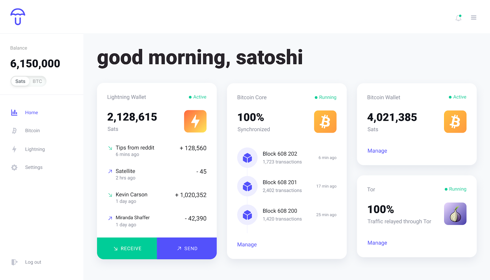
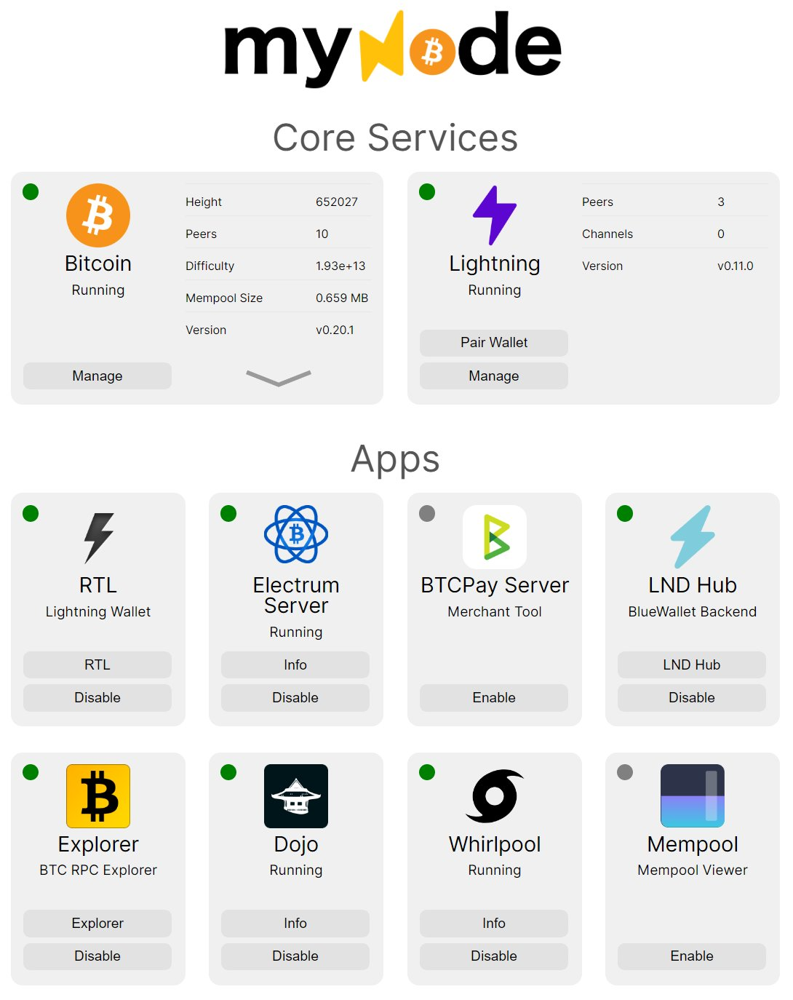
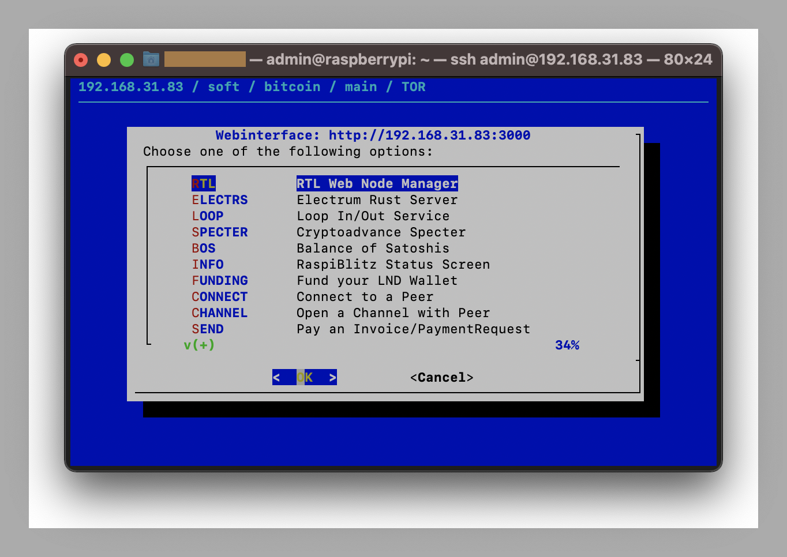

## Which is currently the best Node software for Raspberry Pi?

In a [recent Twitter thread](https://www.twitter.com/softsimon_/status/1327505138282422278) our Community Member Simon (creator of the awesome Block explorer [mempool.space](https://mempool.space/)) has broken down his most experiences with running the most popular Bitcoin Node software solutions for Raspberry:

**I tried 3 of the most popular node solutions for Raspberry Pi 4 and here are my impressions:** 

1. [@getumbrel](https://mobile.twitter.com/getumbrel) is incredibly easy to setup and have up and running immediately with a beautiful web dashboard. It's still under development but has what most people needs. Using Neutrino before finishing the full chain sync is very smart.

    
 
2. [@mynodebtc](https://mobile.twitter.com/mynodebtc) is almost as easy to setup with a easy to use web dashboard. The big deal-breaker for me though was discovering that a license fee is required just to active open source apps like BTCPay and Mempool!

    
 
3. [@RaspiBlitz](https://mobile.twitter.com/RaspiBlitz) has a longer and more advanced setup process. The interface is RPi Display or SSH only making it more technical. But using the menu turning on and off features is easy. It has all the apps one might need like RTL and Specter.

    
 
**Conclusion: I will recommend Umbrel to most people, MyNode if they want more apps that Umbrel yet lack, but I will use Raspiblitz myself and recommend it to all advanced users!**

If you want to provide your own feedback or have questions for Simon, please feel free to comment on the [Twitter Thread](https://www.twitter.com/softsimon_/status/1327505138282422278) or alternatively (if you have the opportunity) discuss with him in person at one of the upcoming Bitcoin meetups in Saigon! :)

[And if you want to sponsor Simon’s work - you can do so here: [mempool.space/about](https://mempool.space/about)]

------------

*If you would like to support the work of the Bitcoin Saigon Community - you can donate some of your Sats to us via our [Donation page!](https://bitcoinsaigon.org/donate-satoshis)*

