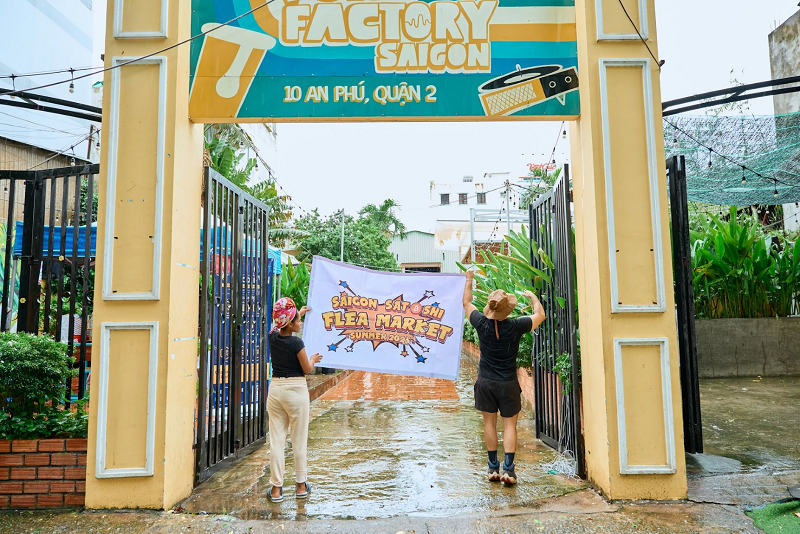

The third edition of the Satoshi Flea Market Saigon came and went - and despite a good bit of flooding summer rain in the early afternoon, over 200 visitors made their way through the gates of our new host venue: Funk Factory Saigon.

The main objectives we pursue with our semi-regular public Flea Markets is two -(maybe three-?) fold:

On one hand, the local Bitcoin OG community has become fairly reclusive in recent years - many having shifted focus toward family life or other long-term priorities. The twice-yearly Flea Market offers a casual gathering point to reconnect: to share old war stories, swap ideas, and catch up over Vietnamese coffee, home-baked cinnamon rolls, or a range of other lovingly crafted items from our vendors.

At the same time, we hope to introduce more “promising pre-coiners” to the Bitcoin ethos - many of whom already embody low-time preference and a commitment to quality in their craft, artisanal goods, or services, even if they haven’t taken the full orange pill just yet.

Rumour has it, a fair amount of Sats changed hands - alongside strengthening the connections of “Layer Zero” of the Bitcoin Network: the human layer that makes it all work behind the computer screens, servers, nodes, and application-layer services.

We’d once again like to extend our sincere thanks to the donors who made it all possible - without their support, we wouldn’t be able to keep the event running sustainably and on a regular schedule.

Dozens of individuals from around the world contributed Sats - some small, others surprisingly generous. Many of them remain anonymous (and can, thanks to the permissionless nature of Bitcoin and Lightning), yet still seem to value what we’re building from afar.

We’d also like to thank all the vendors who joined us - without your participation, the Flea Market wouldn’t have been nearly as much fun… or really a market at all. 🙂

Our shoutout goes to:

[Auntie Bechi](https://x.com/AuntieBechi) - Crocheting for Sats - made with hand picked organic cotton from Vietnam

[Surf School](https://www.vungtausurfschool.com/) - experience the magic of surfing in the ideal beginner’s paradise!

[Hosoco](https://hosoco.nl) - established in Holland and based in Vietnam to help Dutch businesses with their software development

[UniVini Social App](https://univini.app.link/946QJAyPyUb) - The Easiest Way to Practice Languages, Build Networks and Travel

[BitcoinVN Shop](http://bitcoinvn.io/shop) - Hardware Wallets and other self-custody tools in Vietnam

Móc Móc - crochet work that celebrates original craftsmanship, offbeat art

[Savi-Spice](https://savispice.com/) - Nature’s finest ingredients from Vietnam and beyond

[Tigist](https://www.facebook.com/profile.php?id=61577790167561) - a story of Ethiopian heritage, family traditions,unity and a deep love for cooking passed down to generations

[Overmorrow Brewing](https://www.overmorrow.beer/) - craft beers to promote and honor classic styles throughout history – while updating them for the present and the future here in Vietnam

[Lucky Animal Shelter](https://www.facebook.com/luckyshelterhcmc) - dedicated rescue space in Saigon caring for cats (and soon expanding to dogs and more!)

[Mom-to-Be](https://momtobehouse.com/) - premium, clean-ingredient care products for health-conscious parents and babies

[Rawberry](https://linktr.ee/rawberry?) - creators of sweet vegan, gluten‑free, and refined sugar‑free cake delights

[Tron Tria Kitchen](https://www.instagram.com/trontriakitchen?) - Experimental, exceptional cold brew infusion and specialty matcha. Da Lat wisdom in Saigon 

[800 Coffee](https://www.instagram.com/800.coffee/) - A small coffee roastery that aims to bring uniqueness, harmony and quality in coffee flavor to our customers

Zanya Coffee - Delivering Vietnams finest specialty coffee, from Da Lat and Langbiang farms, working with K'ho enthnic minority tribe for the world 

[Nha Phan Botanical Art](https://nhaphanbotanicalart.work/) - Botanical Artist, producing art for people to adore and for scientists to communicate to the world.

Last but not least, our thanks go to Neutron (formerly Neutronpay), who stepped in to help cover the final gaps in the event budget. While they couldn’t send a representative this time around ( they’re extremely busy building one of Asia’s leading Lightning Service Providers - so the excuse is accepted! ) we truly appreciate their continued support.

Keep an eye on our usual channels - we hope to return with the Satoshi Flea Market Saigon: Christmas Edition 2025!

Nostr: npub13ek3cargj3wtuduut5y0jkdlqkmvxmrvzzex96krzejjj580t9ashr4946

Telegram: [https://t.me/BitcoinSaigon\_public](https://t.me/BitcoinSaigon_public)

Twitter/X: [https://x.com/BitcoinSaigon](https://x.com/BitcoinSaigon)

Facebook: [https://www.facebook.com/BitcoinSaigon](https://www.facebook.com/BitcoinSaigon)

Meetup: [https://www.meetup.com/bitcoin-saigon-meetup](https://www.meetup.com/bitcoin-saigon-meetup)

If you enjoyed the event and want to support the cause, you can do so via our [Bitcoin Saigon Donation page](https://bitcoinsaigon.org/donate-satoshis) - or simply scan the QR code below with your Lightning wallet.

Thanks to everyone who came out - and here’s to more “Layer Zero” building ahead!
<iframe id="odysee-iframe" style="width:100%; aspect-ratio:16 / 9;" src="https://odysee.com/%24/embed/%40BitcoinSaigon%3Aa%2FSatoshi-flea-market-7-2025%3Ad?r=82GcFT5UdLxGrDmieSnyaYGXmkjtgv5Q" allowfullscreen></iframe>