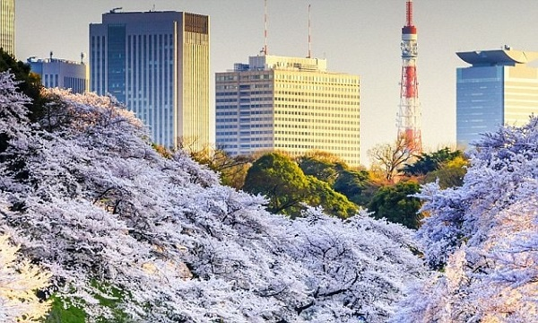
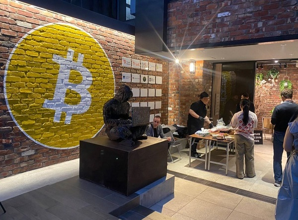
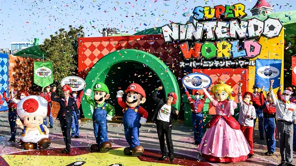
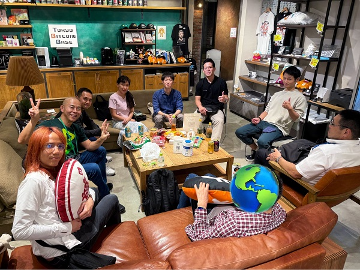
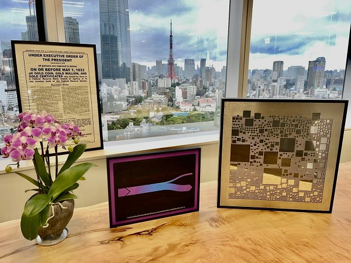
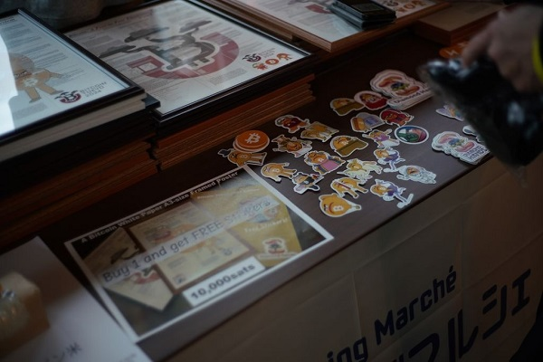
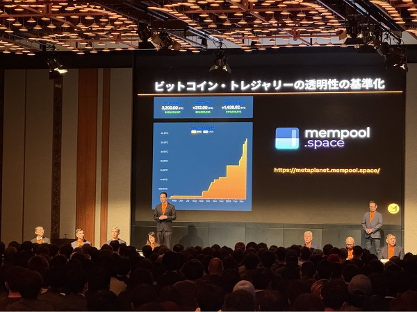

**Bitcoin and Japan** - while it has not always been an easy story over the past one and a half decades, a newly reinvigorated community in Japan remains one where many highly capable and motivated Bitcoiners see in Bitcoin both a tool and an opportunity to help turn around the fate of the nation and its economy for the better - if the right moves are made deliberately.

From the mythical Satoshi Nakamoto and the meteoric rise - and catastrophic collapse - of the once-dominant Mt. Gox exchange platform, to today’s growing wave of [Lightning-powered communities](https://www.diamondhands.community/en) and _Lightning Marchés_ filled with artisanal creations by passionate Japanese makers and merchants - Japan continues to wrestle with what that legacy means, and how to carry it forward into a new era.

Japan - the land of technology, precision, and an unparalleled sense of quality - home to Nintendo, Sony, and sushi - once stood at the forefront of global innovation. 

Yet after decades of economic stagnation, demographic decline, and mounting fiscal strain, a growing number now see in Bitcoin not merely a speculative asset, but a potential lifeline -  a tool to help turn around the fate of a nation if wielded deliberately and wisely.

Signs of renewal are visible:

• Builders and educators at [**Tokyo Bitcoin Base**](https://tokyobitcoin.space/en/) are strengthening local knowledge and community ties

• Global Bitcoin firms like [**Fulgur Ventures**](https://fulgur.ventures/) and [**Blockstream**](https://blockstream.com/) have chosen Japan as a base for their regional operations, cementing its position as a key hub for Bitcoin innovation and investment.

• Japan is home to the HQ of [**Mempool**,](http://mempool.space) the world’s most widely used open-source Bitcoin block explorer - built and maintained by a team with a strong presence in the country.

• Regular community-driven events such as **Lightning Marché** serve as gathering spots that bring together Bitcoiners and those curious about the movement - exchanging Sats for artisanal goods, handmade crafts, and quality products from Japanese makers and merchants.

• Publicly listed firms like **Metaplanet** are adding Bitcoin at a rapid pace to their balance sheets - sparking curiosity among traditional stock market investors about what this “Bitcoin thing” is really about.

Japan’s potential re-emergence in Bitcoin’s global story feels less like a comeback and more like a long-overdue _homecoming_.

Can Japan once again become a guiding force for Bitcoin innovation and its diffusion across East Asia?Find out at [**BTC Japan 2025**](https://btc-jpn.com/en), happening this November in Tokyo.

[Tickets are available now, payable in Lightning](https://btc-jpn.com/en#tickets), of course ⚡